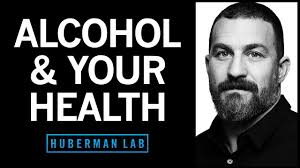

# Opioids_story
Story Pitch Draft #1

For decades, the opioid epidemic was framed as a battle against addiction. We were taught to see it as a crisis of poor choices, a cautionary tale to scare us straight. But today, the enemy is no longer addiction—it's survival. The rise of fentanyl has changed the stakes, turning each encounter with the drug into a deadly gamble. Our drug education is stuck in the past, still focused on preventing addiction, while the real threat—fentanyl—silently claims lives. It's time to confront this new reality: where do we start?

# Opioids 101: Understanding the Substances at Play
Before delving into the epidemic's history, it's crucial to understand what opioids are. The term "opioids" encompasses natural, semi-synthetic, and synthetic drugs that act on the body’s opioid receptors. Opiates, derived directly from opium poppies (Papaver Somniferum), include drugs like morphine, heroin, and codeine. On the other end, synthetic opioids like tramadol and fentanyl are created in laboratories. Falling in the middle are semi-synthetic opioids, like oxycodone and hydrocodone, which are chemically modified derivatives of natural opiates.
In recent years, fentanyl—a synthetic opioid far more potent than morphine—has dominated the illicit drug market. It’s not just more addictive; it’s deadly in even minuscule amounts. Fentanyl's proliferation has fundamentally changed the nature of the opioid crisis.

# The Epidemic’s Evolution: Prescription Pills to Fentanyl’s Surge
When the opioid crisis first emerged in the late 1990s, the problem was straightforward, if still devastating: over-prescription of opioids, particularly oxycodone, led to widespread addiction. Pharmaceutical companies, most infamously Purdue Pharma, aggressively marketed OxyContin as a non-addictive painkiller. Patients, unaware of the risks, became dependent. The initial phase of the crisis was primarily about addiction.
As awareness of the dangers grew, regulations tightened. Physicians became more cautious with prescriptions, and access to pills became restricted. However, the tightened laws merely caused the crisis to evolve. Those already addicted to opioids turned to street drugs, including heroin and illicitly manufactured fentanyl. Meanwhile, public health campaigns painted addiction as a moral failing. Anti-drug programs like D.A.R.E. filled school curriculums, teaching children to avoid their parents' medicine cabinets.
Now, we enter into the fourth decade of the Opioid Epidemic. Once again, it has evolved. Addiction was last generation's problem—ours is fentanyl. People no longer have the luxury of addiction: they are just dying, and we can’t treat people for addiction unless they come to recovery treatment alive. However, our legislature has been slow to adopt this understanding, and our current curriculum for drug education is out of date. So much money is being put into telling kids not to take their parents' pills—the irony is that at least the parent’s pills aren’t going to have fentanyl in them. 

# A National Crisis: Who Is Affected?
When OxyContin first appeared on the market in 1996, it paved the way for an opioid epidemic that would claim hundreds of thousands of lives. From 1999 to 2015, there was a 171% increase in total opioid overdose deaths. Some groups were hit harder than others. Females aged 25-34, for instance, saw a staggering 1,433% increase in opioid-related deaths during this period.
Geography also played a significant role. Data from the Centers for Disease Control and Prevention (CDC) shows that in 2020, Alabama, Arkansas, Tennessee, Louisiana, and Kentucky ranked among the top states with the highest rates of opioid prescriptions. In Alabama, there were enough prescriptions for 80 out of every 100 people—a shocking statistic considering opioids are meant only for severe pain cases. The widespread over-prescription led to addiction and fed into the illegal drug market, often spreading beyond state lines.
These excess pills found their way out of medicine cabinets and onto the streets. "Pill mills" became notorious for prescribing opioids with little regard for medical necessity. By 2021, West Virginia, Indiana, and Louisiana reported the highest increases in opioid-related overdoses. Not a single state reported a decrease in overdose deaths between 1999 and 2021. The epidemic had become ubiquitous.

)

Surveys conducted by local health authorities provide insight into the complex web of social factors that contribute to substance abuse.
In Columbus, Ohio, the [Franklin County Health Department](https://www.columbus.gov/Services/Public-Health) partnered with the U.S. Department of Health and Human Services in 2021 in an effort to combat the opioid epidemic by developing a specified outreach team to work directly with victims of the epidemic. The goal was harm reduction: bridging the gap between addiction and recovery with a formulated plan designed to decrease overdoses and overdose deaths. Every other Wednesday throughout the summer *Walk in for Recovery* events were held at different locations throughout Columbus. They hosted providers of medical care, Naloxone distribution, addiction treatment options, health screenings, wound care, HIV testing, HepA vaccinations, and even assistance with obtaining birth certificates or state IDs. 
Data from the outreach program revealed that 60% of those they helped at these events were either homeless, in shelters, or living in unstable conditions. Nearly a third had overdosed before, with the majority pointing to opioids—and specifically fentanyl—as the cause. Alarmingly, many reported their first experience with drugs was with family members, indicating a deep, generational cycle of substance abuse.
**insert a graph to illustrate this***

# The New Victims: The Impact of Fentanyl
In recent years, the demographic affected by opioid overdoses has shifted. The rise of fentanyl means that overdose deaths are no longer limited to long-time drug users. Deaths are now more sporadic, widespread, and unpredictable.

[A UCLA study](https://www.uclahealth.org/news/release/about-22-high-school-age-adolescents-died-each-week) revealed a startling trend: approximately 22 high school-age adolescents die each week due to drug overdose, with fentanyl being a significant culprit.  The UCLA researchers point out that the ease of access to counterfeit pills laced with fentanyl has exponentially raised the risk for teenagers, many of whom are unwittingly consuming substances far more potent than anticipated. The data challenges the traditional image of drug abuse, illustrating that today's victims are often suburban teens experimenting with what they believe to be relatively harmless substances. These findings bring a grim new layer to the opioid crisis, revealing an intersection of teenage vulnerability, the clandestine spread of fentanyl, and the need for targeted harm reduction strategies in schools and communities nationwide.

# The Push for Change: Education as a Tool for Prevention
Two years ago, Ohio Governor Mike DeWine launched the [Drug Resilience Education Awareness Mentorship (DREAM) program](https://publicsafety.ohio.gov/what-we-do/our-programs/dream). Its aim is to provide educators, local law enforcement officers, parents and guardians with an approach to initiate important “age-appropriate discussions with kids about drug use and how it can negatively impact their futures,” said Governor DeWine. “The new DREAM program is another tool to help reinforce the drug-free message early and often,”.
Also in Columbus, ​​the [Alcohol, Drug and Mental Health Board (ADAMH) of Franklin County](https://adamhfranklin.org/) partners with [16 public school districts](https://adamhfranklin.org/school-services/) in Franklin County and certified behavioral health agencies to provide school-based prevention and early intervention services for all students to support their mental health and wellness journey. The ADAMH school-based prevention investments are grounded in the Strategic Prevention Framework developed by the [Substance Abuse and Mental Health Services Administration (SAMHSA)](https://www.samhsa.gov/).
Their effectiveness is clear. Consider the following graph which depicts the locations of the schools which do and do not have prevention programs. Note that it is overlaid upon a heat map of overdose rates. Note how the darker spots, indicating higher rates of OD are the places with school districts that don’t have prevention programs in place. 
.
I spoke with Ashley Pittman, a social worker responsible for implementing the ADAMH program at Reynoldsburg School District in central Ohio. Her title, “Whole Child Support” is indicative of her mission to prepare students to become well rounded individuals not only in their intellectual intelligence, but also their emotional intelligence. She explained how the ADAMH grant has helped take the financial burden off students, families and schools for helping students connected with healthcare providers. They now start health and wellness classes in elementary schools, with drug use and misuse prevention care being introduced in junior high when students reach their teenage years. 
When asked about how they handle having to discuss this subject that lies on the fine line between education and preemptive exposure, Pittman admitted that they have to sometimes speak guardedly. They discuss addiction, the behaviors and the neuroscience that go along with it. They discuss Narcan and its life saving potential and let students know it is in the principal's office and they can get their own across the street at the police station. However, they don’t have fentanyl test strips. Their legal team had some issues with liability regarding passing out fentanyl test strips. Nevertheless, she disclosed, there have been overdoses in their very own school bathrooms. 

# Real Impact: BirdieLight and The Fight for Transparent Education
While public institutions navigate legal and societal constraints, organizations like BirdieLight are taking a more straightforward approach. Founded by Beth Weinstock after her son Eli's death from unknowingly ingesting fentanyl, BirdieLight educates students about the dangers of fentanyl and actively distributes test strips to high school and college students. Weinstock’s message is blunt: "Fentanyl safety should be as second nature as putting on a seatbelt."

Despite some schools pushing back on her approach, Weinstock remains undeterred. She argues that effective fentanyl education requires transparency and directness. To date, BirdieLight has reached over 55,000 students. However, Weinstock warns that legislating fentanyl education could backfire if it falls into the hands of policymakers who advocate for abstinence-only messages. "Our fight needs to evolve with the crisis," she insists, pointing out that new drugs like xylazine are already complicating overdose interventions, as Narcan cannot reverse its effects.

# The Path Forward: A New Approach to Drug Education
The universal nature of secular education offers a unique platform to address the epidemic's impact. A national, formal curriculum—done right—can educate, not through the lens of religious or moral abstinence, but, grounded in scientific evidence, common sense, and our collective national experience with the dangers of drugs. 
A curriculum as such can harness curiosity and a desire for understanding. The key is to present addiction not as a failing of character but as a profound alteration in brain chemistry. By demystifying the process—explaining how substances hijack the brain’s reward system and reshape its functioning—we can foster a sort of appreciation for the gravity of addiction. Students need to learn that addiction is not a simple matter of willpower but a complex neurological phenomenon.
Some educational programs are beginning to embrace this approach. Andrew Huberman, a renowned neuroscientist at Stanford University, hosts the popular "Huberman Lab Podcast," which aims to discuss "science and science-based tools for everyday life" in an accessible manner. His recent episode, “What Alcohol Does to Your Body, Brain, & Health,” has been integrated into high school health curricula. 
To present substance use as a topic of study rather than judgment can encourage informed conversations and foster a more accurate understanding of addiction.

# Hope on the Horizon: The Next Evolutive Shift in the Epidemic? 
Amid the devastation, there is a glimmer of hope. Earlier this year, Vertex Pharmaceuticals announced they were testing a new non-opioid drug, VX-548, which blocks pain signals before they reach the brain. If successful, it could offer a safer alternative for pain management, free from the risk of addiction.
Even with this potential breakthrough, the crisis demands an updated approach to drug education. Focusing on avoiding parents' pills is outdated; the new threat lies in the illicit substances laced with fentanyl. Our response must pivot from solely addiction prevention to include harm reduction and survival strategies.
The opioid epidemic is no longer just about addiction; it’s about navigating a dangerous world where each encounter with the wrong pill or powder could be fatal. The only way forward is through direct education, transparency, and a relentless drive to adapt our strategies as fast as the crisis evolves.

